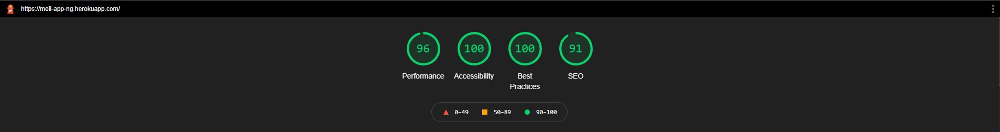

# MeliApp

This project was generated with [Angular CLI](https://github.com/angular/angular-cli) version 11.1.1.

Features of the Project

- Application structure : LIFT
- Responsive Web App
- Lint
- 100% coverage Unit Test
- Angular Universal
- Lazy Loading
- API's Integration with Observables
- Lift Arquitecture
- Postman Collection
- Heroku Integration

[commitlint]: https://commitlint.js.org/#/
[husky]: https://www.npmjs.com/package/husky
[normalizecss]: https://necolas.github.io/normalize.css/
[lift]: https://angular.io/guide/styleguide#lift

## Performance

## Test App

[production]: https://meli-app-ng.herokuapp.com
